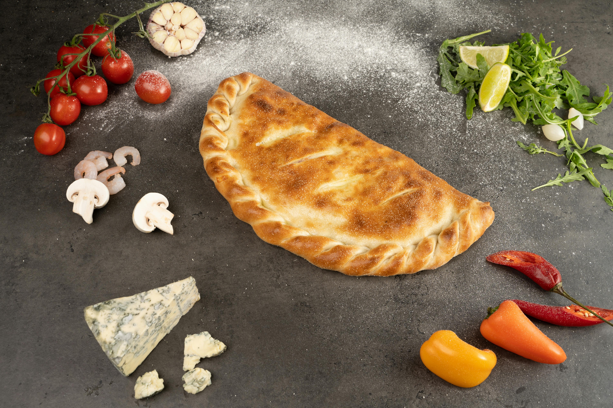
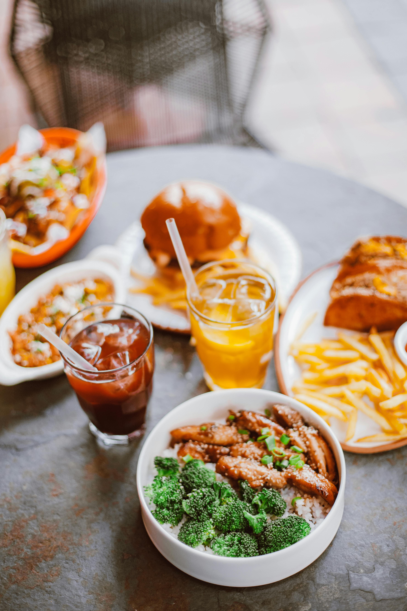

# Menu

## Pizze klasyczne

| Lp. | Pizza: | rozmiar: | 30 cm | 50 cm | 60 cm |
|-|-|-|-|-|-|
| 1. | MARGHERITA (sos pomidorowy, ser, oregano) | | 20 zł | 40 zł | 50 zł |
| 2. | FUNGI (sos pomidorowy, ser, pieczarki) | | 22 zł | 42 zł | 52 zł |
| 3. | SALAMI (sos pomidorowy, ser mozarella, salami) | | 23 zł | 43 zł | 53 zł |
| 4. | VESUVIO (sos pomidorowy, podwójny ser, szynka) | | 24 zł | 44 zł | 54 zł |
| 5. | HAWAJSKA (sos pomidorowy, ser, szynka, ananas) | | 25 zł | 45 zł | 55 zł |
| 6. | MILANO (sos pomidorowy, ser, szynka, papryka, oregano) | | 26 zł | 46 zł | 56 zł |
| 7. | KEBAB (sos pomidorowy, ser, kebab, sos czosnkowy) | | 27 zł | 47 zł | 57 zł |
| 8. | QUATTRO FROMAGGI (sos pomidorowy, cztery sery, oregano) | | 28 zł | 48 zł | 58 zł |
| 9. | GRECKA (sos pomidorowy, ser, oliwki, feta, szynka, sałata lodowa) | | 29 zł | 49 zł | 59 zł |
| 10. | BARBEQUE (sos pomidorowy, ser, kurczak, boczek, cebula, sos barbeque, oregano) | | 30 zł | 50 zł | 60 zł |

## Pizze wegetariańskie

| Lp. | Pizza: | rozmiar: | 30 cm | 50 cm | 60 cm |
|-|-|-|-|-|-|
| 1. | MARGHERITA (sos pomidorowy, ser, oregano) | | 20 zł | 40 zł | 50 zł |
| 2. | FUNGI (sos pomidorowy, ser, pieczarki) | | 22 zł | 42 zł | 52 zł |
| 3. | HAWAJSKA VEGE (sos pomidorowy, ser, roszponka, ananas) | | 25 zł | 45 zł | 55 zł |
| 4. | MILANO VEGE (sos pomidorowy, ser, roszponka, papryka, oregano) | | 26 zł | 46 zł | 56 zł |
| 5. | GRECKA (sos pomidorowy, ser, oliwki, feta, sałata lodowa) | | 29 zł | 49 zł | 59 zł |

## Pizza calzone - zawinięta w pieróg

| Lp. | Pizza: | rozmiar: | 30 cm | 50 cm | 60 cm |
|-|-|-|-|-|-|
| 1. | KEBAB (sos pomidorowy, ser, kebab, sos czosnkowy) | | 27 zł | 47 zł | 57 zł |
| 2. | SALAMI (sos pomidorowy, ser mozarella, salami) | | 23 zł | 43 zł | 53 zł |
| 3. | BARBEQUE (sos pomidorowy, ser, kurczak, boczek, cebula, sos barbeque, oregano) | | 30 zł | 50 zł | 60 zł |

## Makarony

| Lp. | Nazwa | porcja: | 500 g | 650 g |
|-|-|-|-|-|
| 1. | SPAGHETTI NAPOLI (makaron z sosem pomidorowym i serem) | | 30 zł | 36 zł |
| 2. | SPAGHETTI BOLONIA (makaron z sosem bolońskim) | | 31 zł | 37 zł |
| 3. | SPAGHETTI CARBONARA (makaron z sosem carbonara) | | 33 zł | 39 zł |

## Sałatki

| Lp. | Nazwa | porcja: | 500 g | 650 g |
|-|-|-|-|-|
| 1. | SAŁATKA ZE SZPINAKIEM (młody szpinak, suszone pomidory, grillowany ananas) | | 30 zł | 36 zł |
| 2. | SAŁATKA Z SEREM (ser, sałata rzymska, sos vineigrette, pomidory cherry) | | 31 zł | 37 zł |
| 3. | SAŁATKA Z SOJĄ (kotlet sojowy, sałata rzymska, sos vineigrette, orzechy) | | 33 zł | 39 zł |

## Sosy

1. Czosnkowy - 5 zł
2. Pomidorowy - 5 zł
3. Barbeque - 6 zł

## Dodatki

1. Cukinia - 5 zł
2. Karczochy - 6 zł
3. Krewetki - 10 zł

## Napoje

| Lp. | Napój | pojemność: | 250 ml | 500 ml |
|-|-|-|-|-|
| 1. | Woda | | 5 zł | 9 zł |
| 2. | Sok pomarańczowy | | 7 zł | 10 zł |
| 3. | Sok jabłkowy | | 7 zł | 10 zł |
| 4. | Piwo jasne | | 8 zł | 11 zł |
| 5. | Piwo ciemne | | 8 zł | 11 zł |
